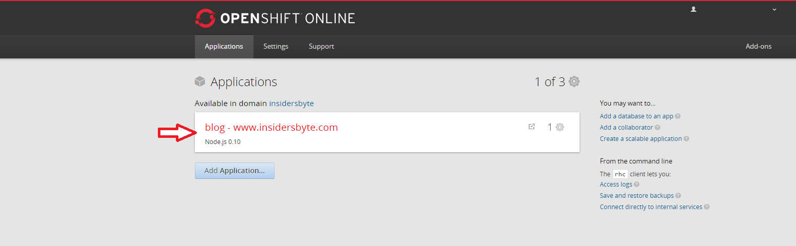
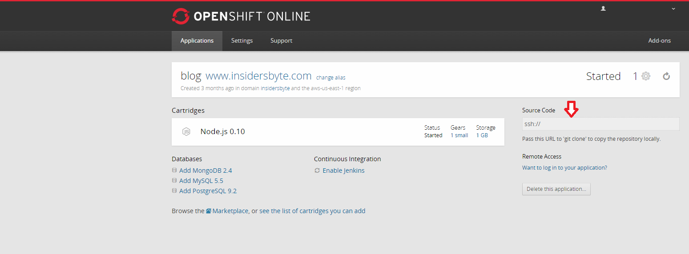

So I decided to compile a mini tutorial comprising of five parts, which go
through the steps involved in starting up a Ghost blog on OpenShift using my
experiences. The topics covered so far are:

1.  [Starting a New Blog With Ghost and Openshift](https://www.insidersbyte.com/setting-up-ghost-on-openshift/)
2.  Git Clone Your OpenShift Ghost Blog (This Post)
3.  [Update Your Ghost Blog](https://www.insidersbyte.com/update-your-openshift-ghost-blog/)
4.  [Use a Custom Domain for Your Ghost Blog](https://www.insidersbyte.com/use-a-custom-domain-for-your-openshift-ghost-blog/)
5.  Free SSL For Your Ghost Blog (Coming soon)

###Outcome of This Tutorial Clone a local copy of your Ghost blog.

###Prerequisites

1.  Have an OpenShift account
2.  Have already deployed an Ghost application
3.  Have already setup rhc

> All of these are covered by the first post in this blog series,
> [Starting a New Blog With Ghost and Openshift](https://www.insidersbyte.com/setting-up-ghost-on-openshift/).

###What is Git It is a very popular and efficient open source Version Control
System.

###Install The latest version of git can be downloaded from
[here](http://git-scm.com/downloads). It is a simple installer that does not
take long to install.

###Clone Now that you have installed git you have to clone your repository from
on OpenShift, this will allow you to make local changes so that you can then
push back to your Ghost application.

Before you can clone your blog you need to know the repository url, this is an
easy process. Firstly you need to sign into your OpenShift account and you
should be presented with a view similar to the image below (of course your name
and domain will be different), all you need to do is click on your application
(the arrow represents your application).

After clicking on the application you should be presented with a view similar to
the image below. You need to copy the source code url as highlighted below (I
have removed the full url from my link and only included the starting part,
yours will contain the full link), this is your repository url that I mentioned
above.

Now that you have your repository you have to open up command prompt and type in
`git clone <repository_url> <directory to create>`.

> Where `<repository_url>` is the url you copied from your OpenShift
> application.

> Where `<directory to create>` is the full path on your file system where you
> want your blog to be cloned to.

###Congratulations Well done you have now cloned a local copy of your blog ready
for you to make changes.

###Further Reading If you want to study more about git they have a helpful
[tutorial](http://git-scm.com/docs/gittutorial).
