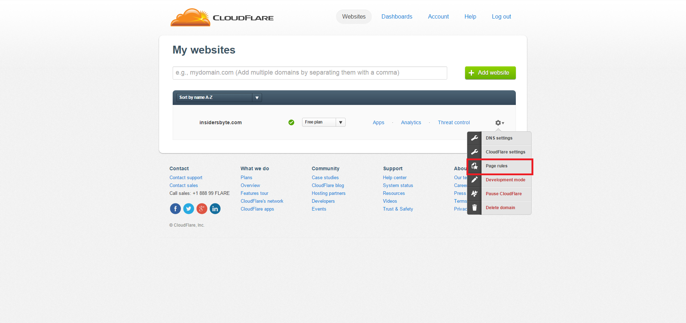
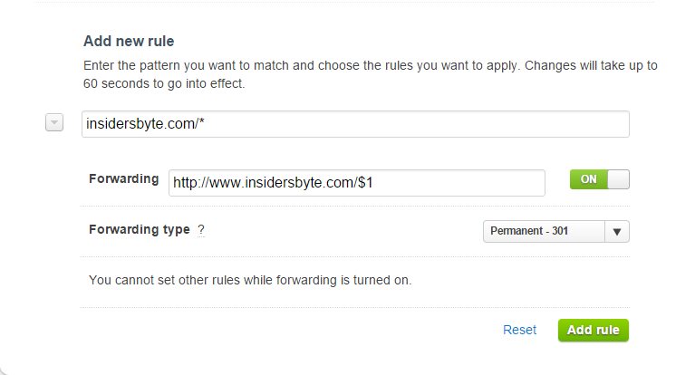
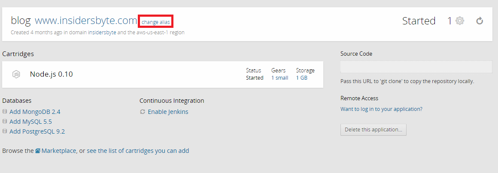
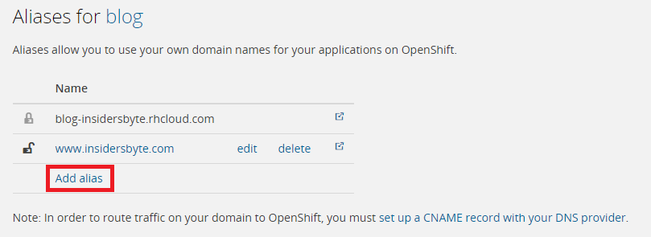

So I decided to compile a mini tutorial comprising of five parts, which go
through the steps involved in starting up a Ghost blog on OpenShift using my
experiences. The topics covered so far are:

1.  [Starting a New Blog With Ghost and Openshift](https://www.insidersbyte.com/setting-up-ghost-on-openshift/)
2.  [Git Clone Your OpenShift Ghost Blog](https://www.insidersbyte.com/git-clone-your-openshift-ghost-blog/)
3.  [Update Your Ghost Blog](https://www.insidersbyte.com/update-your-openshift-ghost-blog/)
4.  Use a Custom Domain for Your Ghost Blog (This Post)
5.  Free SSL For Your Ghost Blog (Coming soon)

###Outcome of this tutorial Have your Ghost blog running on it's your own
domain!

###Prerequisites

* Have a Ghost blog up and running on OpenShift.
* Have a local clone of your Ghost blog.

Although this tutorial is aimed at users of OpenShift it should be a very
similar process on other hosting solutions.

###Get a domain If you have already got a domain that you intend to use for your
blog then skip this section.

Firstly you will need to come up with a list of potential names for your site,
your name must be unique and available to purchase.

You can purchase your domain name from a number of retailers. My favourite
(mainly because it is cheap) is
[Namecheap](http://www.namecheap.com/?aff=83010). You can search on this site to
see if the domain you decided to buy is available and if it is you can buy it.

> The namecheap link above is an affiliate link. If you could please use it to
> support me so that I can carry on blogging. Thank you.

###Change DNS Provider to CloudFlare

Now that you have your own domain we need to change your DNS provider, from the
default one that you get when you get a domain, to one with more features that
we will need.

Cue CloudFlare. I have been using CloudFlare for a little while and I love it.
It has a nice admin dashboard that makes it easy to update multiple domains you
may own in one place. It also offers loads of features for free! This includes
free SSL which will be used in the next tutorial.

CloudFlare have a tutorial for adding a new website and moving your DNS provider
over to them, so I won't go through it, just follow the instructions on the
site.

Once your DNS provider has been moved over, which can take up to 24 hours, you
will be ready to continue.

###Setup your DNS records

Now that you have changed your DNS provider it is now time to change your DNS
records, so that they point to your blog.

The default url for a OpenShift application is
`<application_name>-<OpenShift_domain>.rhcloud.com`. You cannot normally map the
root of your domain to another domain, you would normally have to map it to an
IP address instead. However CloudFlare uses something called CNAME flattening.

> I will confess that I do not know much about CNAME flattening however here is
> a
> [blog post from cloudflare on the matter](https://blog.cloudflare.com/introducing-cname-flattening-rfc-compliant-cnames-at-a-domains-root/).

So let's get on with setting this up then.

First of all you need to delete the existing record you may have for your
website root, This can be identified normally as an A record with the name is
the same as your domain, so for instance the root record for this website is
`insidersbyte.com`.

Now you need to add a new CNAME record for root where the 'is an alias of' field
is set to the address of your blog, as per the image below.

The last change we are going to make to our DNS is to add a CNAME record for
`www.`. Again you need to set the 'is an alias of' field to the address of your
blog, as per the image below.

Finally we are going to setup a redirect for all non www traffic to www. This is
really simple with CloudFlare, you have to navigate to the Page Rules area for
your website. It can be accessed by clicking the gear next to your website on
the dashboard, as per the image below

Now you just have to add a new page rule as per the image below and it will
redirect all non www traffic to www.

The `*` in the URL pattern means any address so for instance
`example.com/example` would get matched if you missed the \* only `example.com`
itself would get matched.

The `$1` in the forwarding address just puts the trailing part of the URL back
in and without it `example.com/example` would forward to `example.com`.

The forwarding type is set to 301 instead of 302 as it is a permanent redirect.

You can now try accessing your new domain and seeing if it goes to your blog.
Please note that this may take up to 24 hours to take effect, in my experience
with CloudFlare it takes a lot less time and is normally done in a few minutes.

###Add your new domain to your OpenShift application This is quite an easy
series of steps. First logon to your OpenShift account and navigate to your
Ghost application. Now click the change alias link.

Now you need to click the add alias link.

Now enter your domain name as shown below.

Click save and you are done.

###DNS changes complete

Hopefully now everything should be working with your domain and you should be
able to access your site, however if you click on any link you will notice you
get redirected to your OpenShift URL. This is okay and expected we will fit this
in the next two sections.

Now that you have setup your DNS records and redirects it is now time to sort
out your Ghost blog so that it is working with your new domain name.

###Add a new environment variable to OpenShift To help keep your ghost config
clean and generic I added an environment variable to OpenShift that points to my
domain. If you use the rhc tool and run the command `rhc set-env OPENSHIFT_APP_DNS_ALIAS=www.yourdomain.com -a yourAppName`. You can if you wish
just add your endpoint straight into your config.js (this is covered later).

###Update Ghost Config This is the final stage.

You need to open your config.js file in the root of your local Ghost repository
and change the line `url: 'http://'+process.env.OPENSHIFT_APP_DNS,` to `url: 'http://'+process.env.OPENSHIFT_APP_DNS_ALIAS,` to make use of the variable we
setup in the previous step (unless you didn't set it up, in which case you can
just put your endpoint in here).

Now you need to commit your changes and push your changes to OpenShift. You will
get some feedback from OpenShift if you use the rhc tools. Once it has been
deployed you should be able to navigate to your domain and upon clicking around
it should all point to your new domain.

###Congratulations Well done you have now using your custom domain for your
blog.
