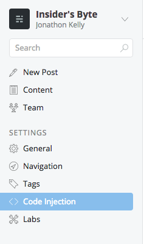
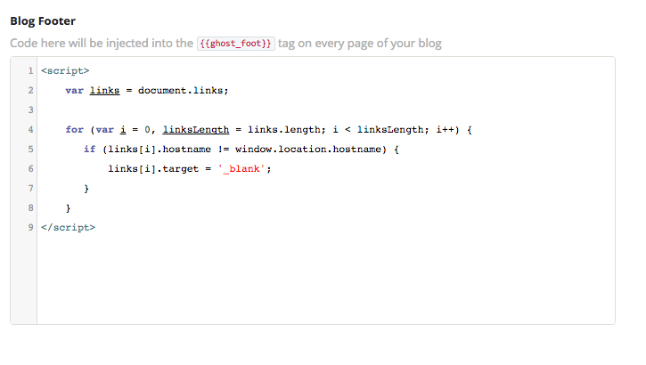

I started writing a pretty big post recently about
[my development stack](https://www.insidersbyte.com/my-development-stack/). This
post has a lot of external links! The problem was that none of the links opened
in a new tab by default, so I started looking at how to solve this.

## Fixing it with markdown

##### Original

```
[react](https://facebook.github.io/react/)
```

##### Fixed

```
[react](https://facebook.github.io/react/" target=_blank)
```

This is quite a simple fix to the problem (even if it is a bit weird just
putting a quote in the middle). The only issue is that it requires you to
remember to do this with every external link you have on the page, I don't know
about you, but I will forget!

I really wanted something that was automatic.

## Fixing it with JavaScript

You can inject a bit of JavaScript that will append a `target="_blank"` to all
of your external link. The code that performs all the "magic" is below. There
are many different implementations that would accomplish this task, some in pure
JavaScript and some requiring jQuery to be present. I chose this one because of
its simplicity and because it does not require jQuery.

```javascript
var links = document.links;

for (var i = 0, linksLength = links.length; i < linksLength; i++) {
  if (links[i].hostname != window.location.hostname) {
    links[i].target = '_blank';
  }
}
```

There are two ways to add this script to your ghost blog.

Firstly by editing your current theme by hand. This approach suffers from a
drawback in that if you are using a third party theme like the default casper
theme and there is an update to it, you have to merge your changes and their
changes together, this is not a terribly time consuming task, but it is
something you have to remember to do, otherwise your links will go back to
opening in the same tab again and I would rather not have anything to forget.

The second approach is to go to the admin section and inject the code into your
footer. This will add the script to every page on your site. This has the
advantage unlike the first approach of being completely separated from the
theme, so no merging updates!

Firstly login to the admin page and click the `Code Injection` tab.



Then copy the script into the `Blog Footer` section.

> Remember to wrap the script in `<script></script>` tags.



Click save.


That's it!

Finally something that is completely automatic.

Let me know if you found a better solution to this problem or if you have any
questions regarding my solution.
