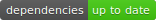

I recently started writing a (very) long post about
[my current development stack](https://www.insidersbyte.com/my-development-stack/)
and I thought that I would write a few more in depth posts about some of the
things that I mentioned. [David](https://david-dm.org/) is the first one choose
to write about.

# So what is David?

It is a free dependency manager for Node.js projects that are both open source
and hosted on GitHub. It allows you to see the status of your dependencies and
add a shiny badge to your README file (and who doesn't want that)!

I personally use it on all of my (latest) open source projects.

# So how does it work?

David works by analysing the dependencies in your package.json file, from there
it will build you your own project status page that will list your dependencies,
peer-dependencies and dev-dependencies, with their respective freshness.

# Here is an example

Here is the [status page for express](https://david-dm.org/expressjs/express).

Here is the dependency badge for express.

Here is the dev-dependency badge for express.

# Why do I need this?

I always think that keeping a project up to date is an important thing! You also
get the benefit of showing other people who might use your repository that you
care about keeping it up to date.

There is also another big advantage of using David. David not only tells you
whether or not a dependency is up to date, it can also tell you if a dependency
has any security vulnerabilities listed against the version you are depending
upon. The security listings come from the
[Node Security Project](https://nodesecurity.io).

> I used the insecure badge recently to fix one of my projects
> [react-mardown-renderer](https://github.com/InsidersByte/react-markdown-renderer).
> It was dependency on [marked](https://github.com/chjj/marked), however a
> recently [security vulnerability](https://nodesecurity.io/advisories/101) was
> issued. This prompted me to change my markdown library and I now use
> [remarkable](https://github.com/jonschlinkert/remarkable).

# How do I use David with my project?

It is extremely simple!

First Make sure your repository is: hosted on GitHub; is public; uses npm as
it's package manager; has a package.json file.

Now you can go to `https://david-dm.org/username/repo` to see your current
dependency status.

> For example I have a project
> [InsidersByte/react-markdown-editor](https://github.com/InsidersByte/react-markdown-editor)
> and if you go to https://david-dm.org/insidersbyte/react-markdown-editor you
> will see the current dependency status of that repository.

Now you can add badges to your README so they appear when people navigate to
your repository on github. It is common practice to add badges at the top of
your README, I add them directly below the title.

> See
> [react-markdown-editor](https://github.com/InsidersByte/react-markdown-editor)
> for an example and
> [here](https://raw.githubusercontent.com/InsidersByte/react-markdown-editor/master/README.md)
> for the raw Markdown.

If you have any dependencies you can add your dependency badge by adding this to
your README ``.
This will add the badge and wrap it in a link to the David status page.

If you have any dev-dependencies you add them by adding this ``

Finally if you have any peer dependencies you can add them with this
``

Congratulations you now have a README proudly displaying the status of your
dependencies and at a glance you can see if your repository is up to date!

# On a final note

There are three styles of badges that David can display.

SVG (my default) `https://david-dm.org/username/repo.svg`

PNG `https://david-dm.org/username/repo.png`

Flat-Square `https://david-dm.org/username/repo.svg?style=flat-square`

