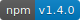
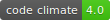
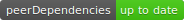
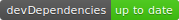

# Gotta catch 'em all

> Yes I am a millennial and I grew up with Pokémon.

I recently started writing a (very) long post about
[my current development stack](https://www.insidersbyte.com/my-development-stack/)
and this is the second in depth post that has come from it.

## So what are README badges?

They are a set of images that at a glance give a quick understanding on the
state of the project.

> A badge also normally serves as a link to a more detailed view of what it is
> displaying.

## Why should I use them?

If you are someone who really values good code, you can use badges to as a way
to display this value to other developers that are looking at your project.

> This doesn't mean that those who don't display badges aren't held to a high
> standard, merely that they don't show it.

Ultimately you can think of badges as a big stamp of approval on your work, that
you can show off to everyone.

## What badges do I use?

#### NPM Module Version - 

This displays the current version number that is deployed on NPM. It saves
anyone having to look in the package.json for the version number.

> This links to the NPM package page.

#### Build Status - 

This displays the current build status from the continuous integration server.

> This links to the build history of the project.

#### Coverage Status - 

This displays the coverage percentage of the tests.

> This links to a more detailed view of the coverage.

#### Code Climate - 

This displays the [Code Climate](https://codeclimate.com/) score. The maximum
possible score is 4.0.

> This links to a more detailed view of the score.

#### bitHound - 

This displays the [bitHound](https://www.bithound.io/) score. The maximum
possible score is 100.

> This links to a more detailed view of the score.

#### Dependency Status - 

This displays the dependency status of the project. (If applicable).

> This links to a more detailed view of the dependencies.

#### Peer Dependency Status - 

This displays the peer-dependency status of the project. (If applicable).

> This links to a more detailed view of the peer-dependencies.

#### Development Dependency Status - 

This displays the dev-dependency status of the project. (If applicable).

> This links to a more detailed view of the dev-dependencies.

#### NPM statistics - 

This displays some more detailed stats of the NPM package.

> This links to the NPM package page.

## How do I get them?

#### NPM Module Version

I get this from [Shields.io](http://shields.io/).

1. Go to the `Version` section, and click npm (or scoped, if your package is
   scoped)
2. Type in the name of your package
3. Copy the Markdown into your README

#### Build Status

I use [Travis CI](https://travis-ci.org/) as my continous integration server for
public repos.

1. Go to the travis page for your project
2. Click on the build shield, select your branch and the format
3. Copy the Markdown into your README

> I use [circleci](https://circleci.com/) for my private repos. It has a similar
> process.

#### Coverage Status

I use [Coveralls](https://coveralls.io) as my coverage status reporter.

1. Go to the detailed view for your project
2. Look for the `README BADGE` section (right hand sidebar on desktop)
3. Click `Embed` and copy the Markdown into your README

#### [Code Climate](https://codeclimate.com/)

1. Go to the detailed view for your project
2. Click on the code climate badge (as seen above)
3. Copy the Markdown into your README

#### [bitHound](https://www.bithound.io/)

1. Go to the detailed view for your project
2. Find the `OVERALL BADGE` and click `Add this badge`
3. Copy the Markdown into your README

#### Dependency Status (including Peer and Development)

I use a service called [David](https://david-dm.org/) to manage my dependencies.
I recently wrote a post on using
[David as a Node.js dependency manager](https://www.insidersbyte.com/david-node-js-dependency-manager/).
This post goes into detail about how to get badges with David.

## Get out there and collect your badges!

Having read through this you should see that adding badges to your project is
really easy!

It shows that you care about your work.

## Real world example

All of the above mentioned badges are used in my
[react-markdown-renderer](https://github.com/InsidersByte/react-markdown-renderer)
project. The raw Markdown can be viewed
[here](https://raw.githubusercontent.com/InsidersByte/react-markdown-renderer/master/README.md).

## Further Badges

There's a list of a lot of different shields available at
[Shields.io](http://shields.io/).
